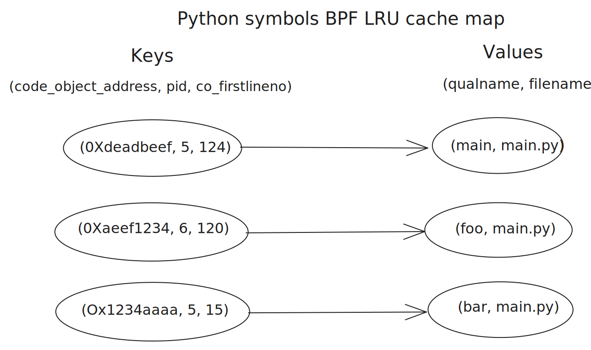

# Python Symbolization

## eBPF symbol collection

Python symbols are stored in a `BPF_MAP_TYPE_LRU_HASH` map called `python_symbols`. The map is filled by an eBPF program during the stack unwinding process.

`python_symbols` contains function names and filenames for each symbol by ID. The symbol ID is a `(code_object_address, pid, co_firstlineno)` tuple which serves as a unique Python symbol identifier within the system.

The Python stack is passed as an array of Python symbol IDs to the user space.

## User space symbolization

Upon receiving a Python sample from the perf buffer, Python symbol IDs need to be converted to function names and filenames. For this, we can look up the `python_symbols` BPF map using another layer of userspace cache to avoid syscall map lookup overhead.
