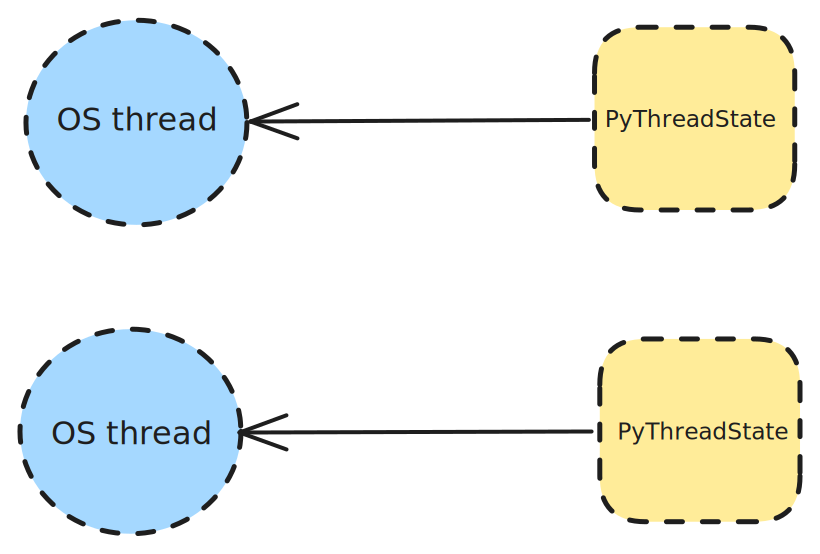
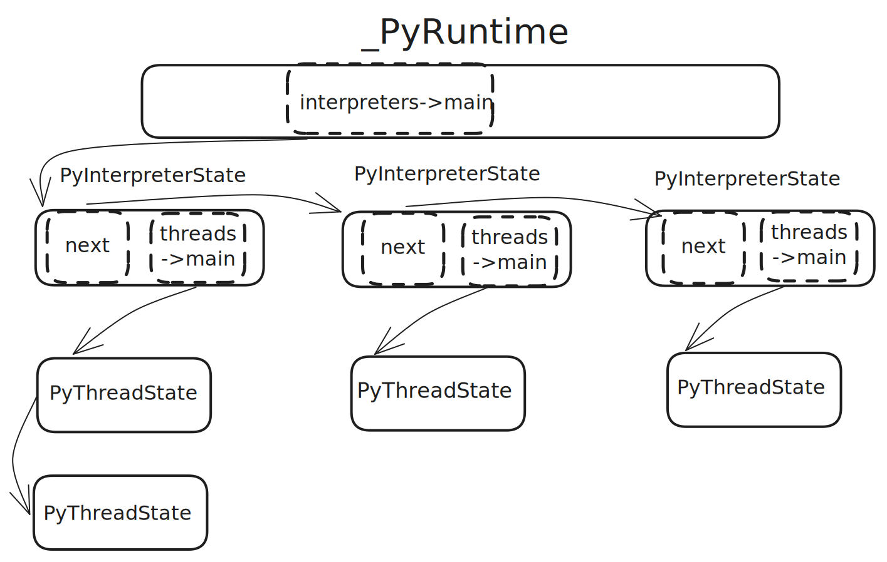

# Python Current Thread State Collection

Each native thread is mapped to one `PyThreadState` structure which contains information about the corresponding Python thread.



Perforator utilizes multiple ways to obtain current `*PyThreadState` in eBPF context - reading from Thread Local Storage (TLS) and extracting from global variables - such as `_PyRuntime` or others. The combination of these approaches and caching helps to improve the accuracy of the `*PyThreadState` collection.

## Reading `*PyThreadState` from TLS

In Python 3.12+, a pointer to current thread's `PyThreadState` is stored in a Thread Local Storage variable called `_PyThreadState_Current`.

In an eBPF program, the pointer to userspace thread structure can be retrieved by reading `thread.fsbase` from the `task_struct` structure. This structure can be obtained with the `bpf_get_current_task()` helper. The Thread Local Image will be to the left of the pointer stored in `thread.fsbase`.

The exact offset of thread local variable `_PyThreadState_Current` in Thread Local Image is unknown yet. Therefore, the disassembler is used to find the offset of `_PyThreadState_Current`.


### Parsing offset of `_PyThreadState_Current` in Thread Local Image

`_PyThreadState_GetCurrent` is a simple getter function which returns the pointer from `_PyThreadState_Current` thread local variable and looks somewhat like this:

**Optimized build**:

```
000000000028a0b0 <_PyThreadState_GetCurrent@@Base>:
  28a0b0:       f3 0f 1e fa             endbr64
  28a0b4:       64 48 8b 04 25 f8 ff    mov    %fs:0xfffffffffffffff8,%rax
  28a0bb:       ff ff
  28a0bd:       c3                      ret
  28a0be:       66 90                   xchg   %ax,%ax
```

**Debug build**:

```
0000000001dad910 <_PyThreadState_GetCurrent>:
 1dad910:       55                      push   %rbp
 1dad911:       48 89 e5                mov    %rsp,%rbp
 1dad914:       48 8d 3d 15 6e 65 00    lea    0x656e15(%rip),%rdi        # 2404730 <_PyRuntime>
 1dad91b:       e8 10 00 00 00          callq  1dad930 <current_fast_get>
 1dad920:       5d                      pop    %rbp
...
...
...
0000000001db7c50 <current_fast_get>:
 1db7c50:       55                      push   %rbp
 1db7c51:       48 89 e5                mov    %rsp,%rbp
 1db7c54:       48 89 7d f8             mov    %rdi,-0x8(%rbp)
 1db7c58:       64 48 8b 04 25 00 00    mov    %fs:0x0,%rax
 1db7c5f:       00 00
 1db7c61:       48 8d 80 f8 ff ff ff    lea    -0x8(%rax),%rax
 1db7c68:       48 8b 00                mov    (%rax),%rax
 1db7c6b:       5d                      pop    %rbp
 1db7c6c:       c3                      retq
```

Looking at these functions, the offset relative to `%fs` register which is used to access `_PyThreadState_Current` variable in userspace can be extracted for later use in the eBPF program.

## Restoring the mapping `native_thread_id` -> `*PyThreadState` using `_PyRuntime` global state

Starting from Python 3.7, there is a global state for CPython runtime - `_PyRuntime`. The address of this global variable can be found in the `.dynsym` section. This structure contains the list of Python interpreter states represented by `_PyInterpreterState` structure.

From each `_PyInterpreterState`, the pointer to the head of `*PyThreadState` linked list can be extracted.



Each `PyThreadState` structure stores a field `native_thread_id` which can be checked against current TID to find the correct Python thread.

Using all this knowledge, the linked list of `*PyThreadState` structures can be traversed and the BPF map with the mapping `native_thread_id` -> `*PyThreadState` can be filled. This mapping can be further used.

## Combination of both approaches

By combining both approaches, we can improve the accuracy of the stack collection. `_PyThreadState_Current` is `NULL` if the current OS thread is not holding a GIL. In this case, the mapping `native_thread_id` -> `*PyThreadState` can be used to find the correct `*PyThreadState`. Also, occasionally we need to trigger the `PyThreadState` linked list traversal to fill the map.

Collecting the stack of threads which are not holding a GIL is crucial for a more accurate picture of what the program is doing. The OS thread may be blocked on I/O operations or executing compression/decompression off-GIL.
